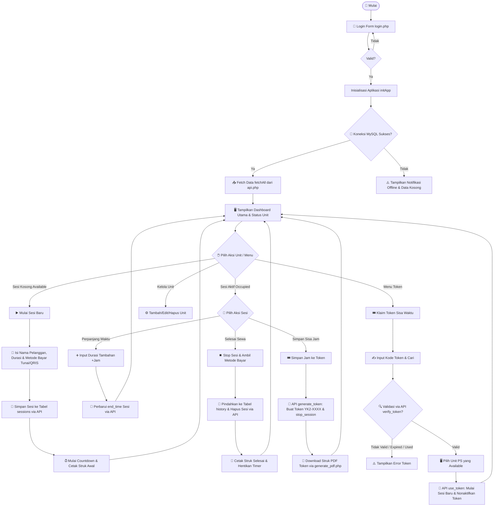

# 📊 Flowchart Sistem & Daftar Metode: YK2 Gaming Admin Panel
> **Kategori Projek**: Alur Data & Logika Fungsi Pemrograman (Studi Kasus UKMK/UMKM)  
> **Lingkungan Running**: Localhost Server (XAMPP / LAMPP)  
> **Bahasa Pemrograman**: JavaScript (ES6+), PHP Native 8.x, SQL.

Dokumen ini berisi gambaran visual berupa diagram alir (*Flowchart*) sistem bisnis aplikasi **YK2 Gaming Admin Panel** serta daftar terperinci mengenai metode/fungsi pemrograman yang berjalan pada sisi klien (*Client-side*) maupun peladen (*Server-side*).

---

## 🧭 1. Flowchart Sistem Utama
Diagram alir berikut menggambarkan proses logika aplikasi dari saat pertama kali dimuat di browser, validasi sesi, hingga penanganan aksi sewa, pembayaran, dan sistem penyimpanan token waktu bermain:



---

## 🛠️ 2. Daftar Metode Pemrograman Frontend (`app.js` & inline scripts)

Semua fungsi di sisi klien dibangun menggunakan JavaScript modern berorientasi aksi (*Event-driven*) secara asinkron:

### A. Fungsi Inti & Inisialisasi
* **`initApp()`**
  * **Input/Output**: Void -> Void
  * **Deskripsi**: Dipanggil setelah `DOMContentLoaded`. Mempersiapkan elemen UI dasar, mengeset label tanggal lokal di header menggunakan `.toLocaleDateString('id-ID')`, dan memanggil `fetchAll()`.
* **`fetchAll()`**
  * **Input/Output**: Void -> Promise<Void>
  * **Deskripsi**: Melakukan request asinkron ke `api.php?action=fetch_all`. Setelah data diterima, fungsi menyaring unit khusus mode `'ps'` ke variabel global `units`, mencatat sesi ke `sessions`, riwayat ke `historyData`, lalu memanggil `renderAll()` untuk menggambar ulang DOM.
* **`api(action, data)`**
  * **Input/Output**: `(action: String, data: Object|null)` -> `Promise<Object>`
  * **Deskripsi**: Wrapper Fetch API. Jika `data` dikirimkan, request diset menggunakan metode POST dengan `body: JSON.stringify({action, ...data})`. Jika `data` kosong, request bertipe GET dengan query parameter. Dilengkapi pencegah cache browser dengan menambahkan timestamp `t=Date.now()`.

### B. Fungsi Operasional Sesi (Billing Sesi)
* **`showModalMulai(unitId)`**
  * **Input/Output**: `(unitId: String)` -> Void
  * **Deskripsi**: Membuka modal pop-up `modal-mulai` untuk unit yang kosong. Menginisialisasi input nama, mengatur nominal uang pas, dan menyetel metode pembayaran default ke `'tunai'`.
* **`konfirmasiMulai()`**
  * **Input/Output**: Void -> Promise<Void>
  * **Deskripsi**: Mengambil data input kasir dari modal mulai sesi. Menghitung durasi milidetik sewa. Mengirimkan payload baru ke API:
    ```javascript
    await api('insert_session', { unit_id, unit_name, customer, mode: 'ps', start_time, end_time, duration_minutes, harga, metode_bayar })
    ```
* **`showModalStop(unitId)`**
  * **Input/Output**: `(unitId: String)` -> Void
  * **Deskripsi**: Menampilkan modal konfirmasi penutupan sesi `modal-stop`, menampilkan sisa waktu sewa ( countdown ) dan nama pelanggan.
* **`konfirmasiStop()`**
  * **Input/Output**: Void -> Promise<Void>
  * **Deskripsi**: Membaca sesi aktif. Mengalkulasi tarif sewa penuh (tarif per jam x durasi dalam jam). Menyimpan data sementara ke dalam `_stopPaymentData`, lalu memanggil `bayarStopSesi(sessions.metode_bayar)` secara otomatis.
* **`bayarStopSesi(metodeBayar)`**
  * **Input/Output**: `(metodeBayar: String)` -> Promise<Void>
  * **Deskripsi**: Mengirim instruksi ke `api.php?action=stop_session` dengan detail sesi dan nominal uang yang dibayarkan.

### C. Fungsi Manajemen Token (Simpan Sisa Jam)
* **`showModalToken(unitId, purchasedMins, remMins)`**
  * **Input/Output**: `(unitId: String, purchasedMins: INT, remMins: INT)` -> Void
  * **Deskripsi**: Membuka modal pembuatan token `modal-token`. Memverifikasi apakah sisa waktu bermain minimal 15 menit. Jika kurang, fungsi akan langsung memicu error toast.
* **`doGenerateToken()`**
  * **Input/Output**: Void -> Promise<Void>
  * **Deskripsi**: Mengirim request POST ke `api.php?action=generate_token` dengan mengirimkan `unit_id` dan `remaining_minutes`. Jika respons sukses, kode token akan ditampilkan di UI dan kasir dapat mencetak/mengunduh PDF.
* **`verifikasiToken()`**
  * **Input/Output**: Void -> Promise<Void>
  * **Deskripsi**: Membaca input kode token dari form kasir, mengonversi teks ke huruf besar (Uppercase) secara otomatis, lalu memanggil backend API `verify_token` untuk mendapatkan durasi sisa bermain yang valid.
* **`gunakanToken()`**
  * **Input/Output**: Void -> Promise<Void>
  * **Deskripsi**: Mengirim request POST ke `api.php?action=use_token` dengan parameter `token_code` dan `unit_id` pilihan kasir untuk memulai sesi bermain baru menggunakan sisa waktu dari token tersebut.

### D. Fungsi Utilitas & UI Rendering
* **`remainingSecs(session)`**
  * **Input/Output**: `(session: Object)` -> `INT`
  * **Deskripsi**: Menghitung sisa detik bermain. Mengganti spasi pada datetime MySQL menjadi `'T'` untuk menghasilkan format ISO yang aman agar terhindar dari bug `NaN` di browser Apple/Safari.
* **`tickTimer(sess)`**
  * **Input/Output**: `(sess: Object)` -> Void
  * **Deskripsi**: Fungsi internal timer ticker yang dipanggil setiap 1 detik. Menghitung sisa detik, memformat ke bentuk string `HH:MM:SS` menggunakan `fmtCountdown()`, dan memperbarui lebar progress bar (.prog-fill) berdasarkan persentase durasi terlewati.

---

## ⚙️ 3. Daftar Metode Pemrograman Backend (`api.php`)

Metode di sisi backend PHP dirancang modular dengan pemanggilan aksi berbasis percabangan (*Switch Action*) yang menerima payload JSON:

### A. Koneksi & Utilitas Database
* **`getDB()`**
  * **Input/Output**: Void -> `PDO Instance`
  * **Deskripsi**: Inisialisasi koneksi MySQL menggunakan Driver PDO. Dilengkapi opsi `PDO::ATTR_EMULATE_PREPARES => false` untuk memaksa sistem menggunakan Prepared Statement asli bawaan MySQL agar tahan terhadap SQL Injection.
* **`sendJSON($data, $code)`**
  * **Input/Output**: `($data: Array|Object, $code: INT)` -> Void (Terminates script)
  * **Deskripsi**: Menyetel HTTP response header ke `application/json`, mengirim status code, mencetak data hasil encoding JSON, lalu memanggil `exit()`.

### B. Bisnis Logika Sesi & Keuangan
* **`fetchAll()`**
  * **Input/Output**: Void -> Void (JSON Response)
  * **Deskripsi**: Mengambil seluruh entri dari tabel `units`, `sessions`, `saved_sessions`, dan `history`. Pada pengambilan riwayat (`history`), query menggabungkan data token untuk transaksi bertipe `simpan_jam`.
* **`insertSession()`**
  * **Input/Output**: Void -> Void (JSON Response)
  * **Deskripsi**: Membaca JSON payload. Menjalankan query prepared statement:
    ```sql
    INSERT INTO sessions (id, unit_id, unit_name, customer, mode, start_time, end_time, duration_minutes, metode_bayar, harga) VALUES (?, ?, ?, ?, ?, ?, ?, ?, ?, ?)
    ```
* **`stopSession()`**
  * **Input/Output**: Void -> Void (JSON Response)
  * **Deskripsi**: Memulai transaksi database. Memasukkan data transaksi ke tabel `history` (dengan kolom `total` = `0` jika dibayar menggunakan token) untuk mencegah pembukuan ganda. Menghapus sesi aktif dari tabel `sessions`, lalu melakukan `commit()`. Jika salah satu query gagal, memicu `rollBack()`.

### C. Logika Manajemen Token (`saved_tokens`)
* **`generateTokenCode($pdo)`**
  * **Input/Output**: `($pdo: PDO)` -> `String` (Format `YK2-XXXX`)
  * **Deskripsi**: Logika generator kode token. Memilih 4 karakter alfanumerik acak dari daftar karakter `'ABCDEFGHIJKLMNOPQRSTUVWXYZ0123456789'`. Melakukan validasi uniqueness di tabel `saved_tokens` maksimal 100 kali iterasi untuk menjamin tidak ada duplikasi kode.
* **`generateToken()`**
  * **Input/Output**: Void -> Void (JSON Response)
  * **Deskripsi**: Memverifikasi keberadaan sesi aktif di unit. Menghitung sisa menit bermain menggunakan rumus:
    ```php
    $remaining = max(0, ceil(($endTimeTimestamp - time()) / 60));
    ```
    Memastikan sisa waktu bermain minimal 15 menit, lalu menyimpan token baru dengan masa kedaluwarsa 30 hari:
    ```sql
    INSERT INTO saved_tokens (id, token_code, unit_id, unit_name, customer_name, remaining_minutes, is_used, created_at, expired_at) VALUES (?, ?, ?, ?, ?, ?, 0, NOW(), DATE_ADD(NOW(), INTERVAL 30 DAY))
    ```
* **`verifyToken()`**
  * **Input/Output**: Void -> Void (JSON Response)
  * **Deskripsi**: Memvalidasi token dari input query. Mengembalikan detail token jika token terdaftar, belum digunakan (`is_used` = `0`), dan belum melewati timestamp `expired_at`.
* **`useToken()`**
  * **Input/Output**: Void -> Void (JSON Response)
  * **Deskripsi**: Melakukan transaksi klaim token. Memeriksa status kevalidan token dan ketersediaan unit tujuan sewa. Memulai sesi baru dengan durasi dari token dan menyetel `metode_bayar` = `'token'`. Menandai token dengan query update:
    ```sql
    UPDATE saved_tokens SET is_used = 1, used_at = NOW(), used_unit_id = ? WHERE token_code = ?
    ```
* **`cleanupExpiredTokens()`**
  * **Input/Output**: Void -> `INT` (Jumlah baris terhapus)
  * **Deskripsi**: Membersihkan log token lama di database untuk menghemat kapasitas storage server. Menghapus token yang sudah dipakai (`is_used` = `1`) dan token kedaluwarsa (`is_used` = `0`) yang umurnya telah melewati 90 hari.
    ```sql
    DELETE FROM saved_tokens WHERE (is_used = 1 AND used_at < DATE_SUB(NOW(), INTERVAL 90 DAY)) OR (is_used = 0 AND expired_at < DATE_SUB(NOW(), INTERVAL 90 DAY))
    ```
